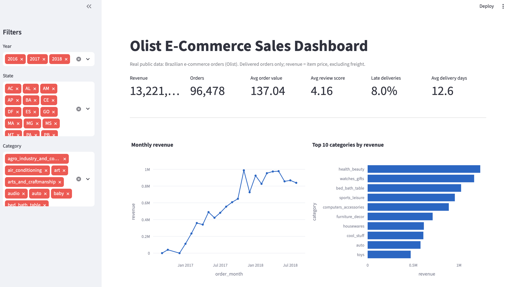

# Olist E-Commerce Sales Analysis (Python, Pandas, SQL, Streamlit)

End-to-end analysis of a real Brazilian e-commerce dataset: data cleaning, SQL analysis, and an interactive dashboard.

> Fill every `[...]` with numbers from YOUR real output (`data/clean/data_quality_report.md` and `outputs/*.csv`). Delete this line when done.

## Business questions
1. How is revenue changing month to month?
2. Which product categories and states drive revenue?
3. Does late delivery hurt customer reviews?
4. How do customers pay, and how many buy again?

## Dataset
[Brazilian E-Commerce Public Dataset by Olist](https://www.kaggle.com/datasets/olistbr/brazilian-ecommerce) (Kaggle), orders from [first date] to [last date]. License: [check the Kaggle page and state it]. Raw data is not included in this repo; download it from Kaggle into `data/raw/`.

## Tools
Python, Pandas, SQLite, SQL (JOINs, CTEs, window functions), Streamlit, Plotly, Git/GitHub.

## Method
1. **Clean** (`python/clean_data.py`): [N] raw orders, [N] order items, [N] reviews and 4 more tables checked for duplicates, missing values and impossible dates. Full list: `data/clean/data_quality_report.md`.
2. **Store**: cleaned tables loaded into a SQLite database (`python/build_db.py`).
3. **Analyse**: 8 SQL queries in `sql/analysis.sql`, results in `outputs/`.
4. **Visualise**: Streamlit dashboard with filters (year, state, category) and 6 KPIs.

## Data quality issues found and fixed
- [N] orders marked delivered but missing a delivery date
- [N] orders with more than one review (kept the latest)
- [N] products with a missing category (labelled "unknown")
- [add the rest from your report]

## Key findings
- **Revenue:** [e.g. monthly revenue grew from X to Y between A and B]
- **Categories:** top 3 categories account for [N]% of revenue ([names])
- **Geography:** [state] contributes [N]% of revenue
- **Delivery vs reviews:** late orders average [X] stars vs [Y] for on-time orders; [N]% of late orders get a 1-2 star review
- **Repeat customers:** only [N]% of customers ordered more than once

## Definitions
Delivered orders only. Revenue = item price (excluding freight). Late = delivered after the estimated date. Customers are identified by `customer_unique_id`, not `customer_id`.

## Dashboard


## How to run
```bash
python3 -m venv venv && source venv/bin/activate
pip install -r requirements.txt
# put the Olist CSV files in data/raw/
python python/clean_data.py
python python/build_db.py
python python/run_queries.py
streamlit run python/app.py
```

## Limitations
Data covers 2016-2018 only; analysis is descriptive (no causal claims); [add your own].
